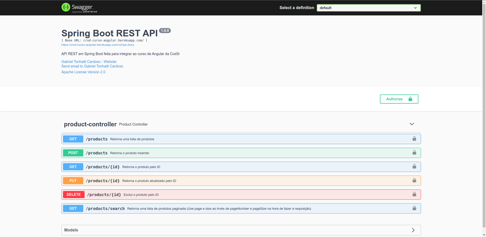

<h1 align="center">Projeto CRUD Angular - Curso Cod3r </h1>


# Índice

- [Sobre](#-sobre)
- [Tecnologias usadas](#-tecnologias-usadas)
- [Documentação da API](#-documentacao-da-api)
- [Hospedagens](#-hospedagens)
- [Como fazer o download do projeto](#-como-fazer-o-download-do-projeto)

---

## 🔖 Sobre

O projeto foi desenvolvimento no curso de Angular da Cod3r Cursos, e o Backend foi feito em Spring Boot para integrar com o projeto em Angular.

---

## 🚀 Tecnologias usadas

Este projeto foi desenvolvido usando as seguintes tecnologias.

- CSS3
- TypeScript
- Angular
- Java 11
- Spring Boot
- MySQL
- PostgreSQL
- VS Code
- Intellij IDEA

---

## Documentação da API

[Swagger](https://crud-curso-angular.herokuapp.com/swagger-ui/index.html)



---

## 🚀 Hospedagens

Fronend:

[Netlify - Crud Angular + Spring Boot ](https://crud-angular-springboot.netlify.app/)

Backend (API):

[Heroku - API Spring Boot ](https://crud-curso-angular.herokuapp.com/products)

---

## 🗂 Como fazer o download do projeto

Via Https:

``` bash
    git clone https://github.com/GabrielTonhatti/curso-angular.git
```

Via SSH:

``` bash
    git clone git@github.com:GabrielTonhatti/curso-angular.git
```

---

Developed ❤ by Gabriel Tonhatti